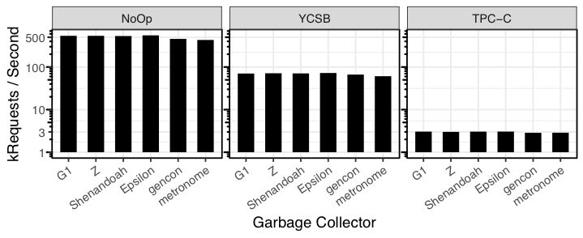
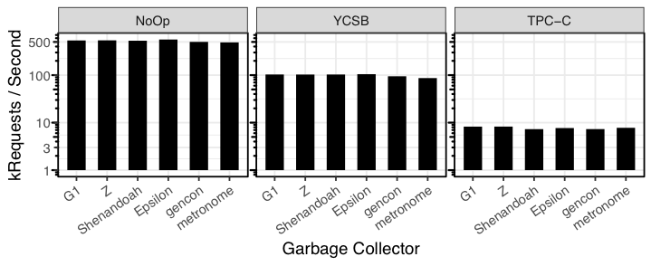
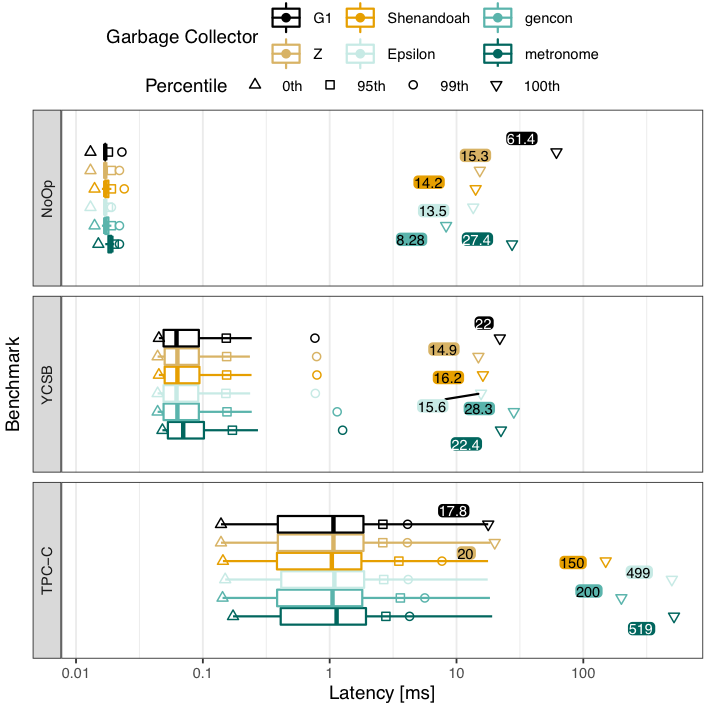
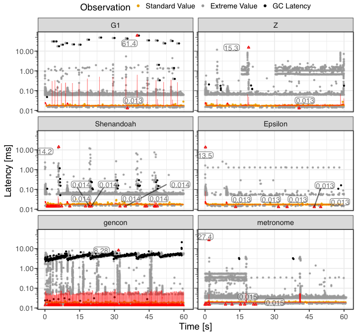
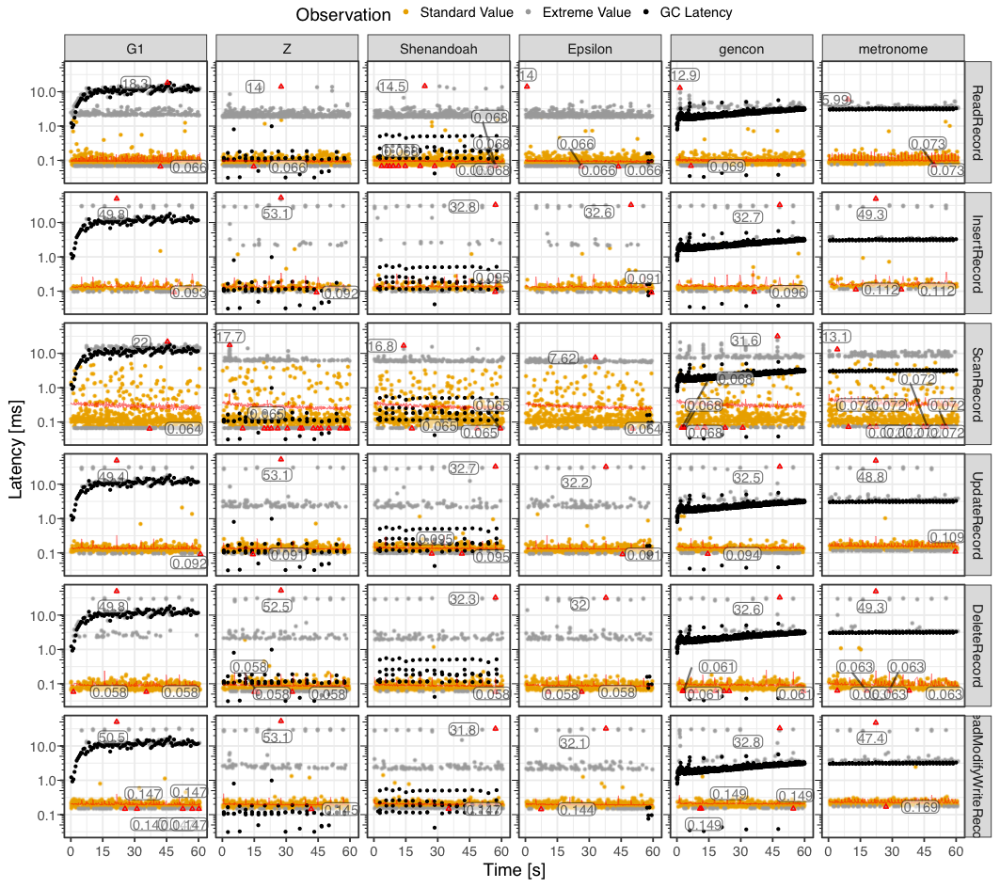
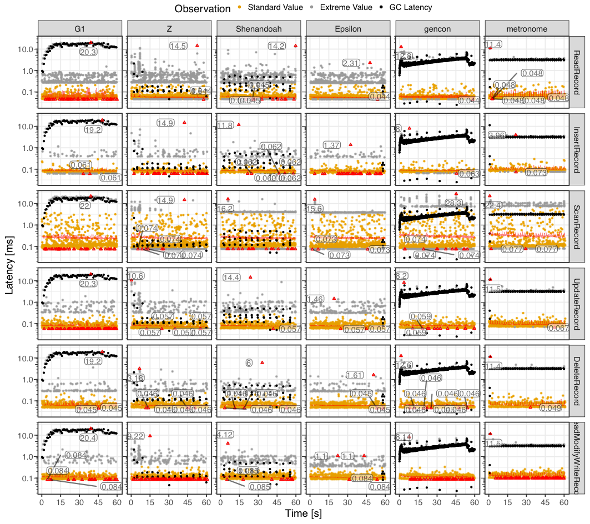
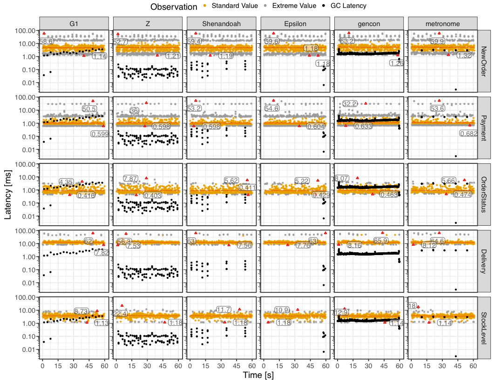
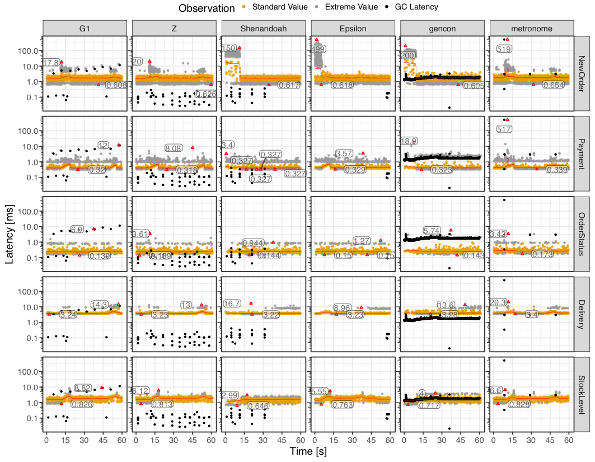

# Tell-Tale Tail Latencies: Pitfalls and Perils in Database Benchmarking

## Supplementary Material

### Figure 1

#### MariaDB

#### PostgreSQL

### Figure 2

#### MariaDB

#### PostgreSQL

### Figure 3

#### MariaDB

#### PostgreSQL

### Figure 4

All used GCs and all transactions are shown.

#### MariaDB

#### PostgreSQL

### Figure 5

All used GCs and all transactions are shown.

#### MariaDB

#### PostgreSQL

